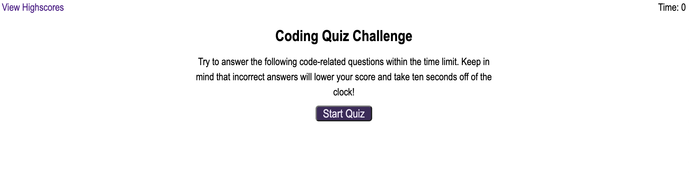

# quiz-with-javascript
## Description
* quiz-with-javascript is a quiz, all in one html page. The user will start the quiz, and stay on the same page to answer each question before submitting their score and checking the highscore list.

* To use the quiz, click the Start Quiz button.

* See page at: [Coding Quiz](https://caitlinw29.github.io/quiz-with-javascript/)

## User Story

```
AS A coding boot camp student
I WANT to take a timed quiz on JavaScript fundamentals that stores high scores
SO THAT I can gauge my progress compared to my peers
```

## Acceptance Criteria

```
GIVEN I am taking a code quiz
WHEN I click the start button
THEN a timer starts and I am presented with a question
WHEN I answer a question
THEN I am presented with another question
WHEN I answer a question incorrectly
THEN time is subtracted from the clock
WHEN all questions are answered or the timer reaches 0
THEN the game is over
WHEN the game is over
THEN I can save my initials and my score
```
